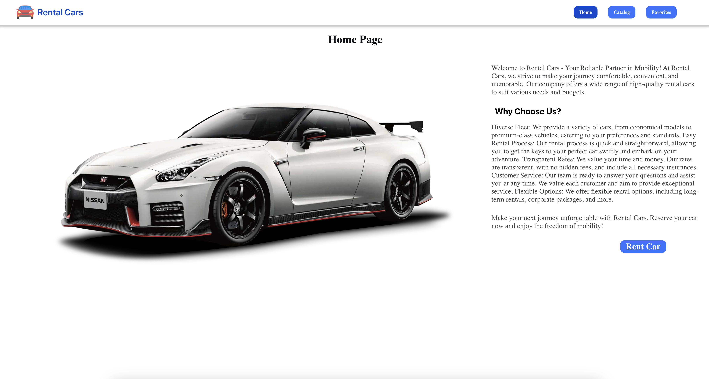

# RentalCar :oncoming_automobile:

## Live page:

[**RentCar**](https://golik07.github.io/rent-car-task/)

## Technologies used:

| `FrontEnd`        | `BackEnd`  | `General`  |
| ----------------- | ---------- | ---------- |
| HTML5/CSS3        | Mockapi.io | VSCode     |
| JavaScript        |            | GIT/GitHub |
| React             |            | Figma      |
| Redux Toolkit     |            |            |
| React Router      |            |            |
| Axios             |            |            |
| Styled Components |            |            |
| Material-UI       |            |            |

## Installation

1. Clone the repository:
   `git clone https://github.com/Golik07/rent-car-task.git`
2. Install the dependencies: `npm install`
3. Run development mode: `npm run dev`
4. Start local server: `npm start`
5. Run production build: `npm build`
